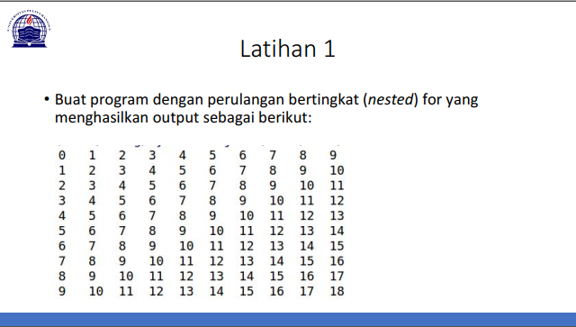
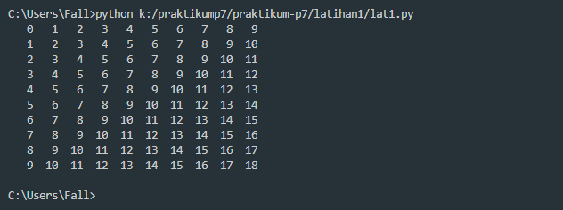
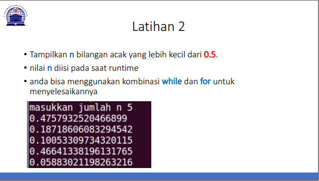
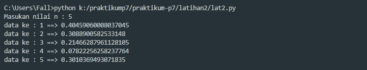

# Tugas Pertemuan ke-7 [Senin 02-10-2020]
- ***Simpan project Praktikum hari ini ke repository***
- ***Buat penjelasan setiap Lab/Latihannya pada file README.md***
<br>
<pre>
Nama    : Naufal Nirwansyah 
Kelas   : TI.20.A1
NIM     : 312010174
Dosen   : Agung Nugroho S.Kom, M.Kom
</pre>

***

# Latihan 1
<br>
Pada Pertemuan ke-7 kemarin, saya mendapat tugas dari Dosen Bahasa Pemrograman saya untuk mengerjakan tugas membuat repo di github. <br>

Pada **Latihan 1** ini saya diminta untuk membuat program dengan perulangan bertingkat (nested).

**Dibawah ini adalah latihan yang diberikan oleh Dosen :**<br>
<div align="center">

</div>
<br>
<br>
Untuk membuat program untuk tugas diatas, saya menggunakan source code sebagai berikut: <br>

```
for row in range(10):
    for col in range(10):
        number = row + col
        if number < 10:
            empty = "  "
        else:
            empty  = " "
        print(empty, number, end = '')
    print()
```
<br>

**Source code diatas akan muncul result sebagai berikut:** <br>
<div align="center">

</div>
<br>
Maka muncul result seperti latihan diatas.<br>
**Penjelasan untuk source code diatas adalah sebagai berikut :**

***

# Latihan 2

Pada **Latihan 2** ini saya diminta untuk membuat program seperti gambar dibawah ini: <br>
<div align="center">

</div>
<br>
Untuk membuat program untuk tugas diatas, saya menggunakan source code sebagai berikut: <br> 

```
import random
nilai = int(input('Masukan nilai n : '))
a = 0
for x in range (nilai):
    i = random.uniform(.0,.5)
    a+=1
    print('data ke :',a,'==>', i)
```
**Source code diatas akan muncul result sebagai berikut:** <br>
<div align="center">

</div>
<br>

**Penjelasan untuk source code diatas adalah sebagai berikut :**

<br>

- `import random` berfungsi untuk memanggil library random, dimana random berfungsi untuk menentukan pilihan secara acak. <br>
- `nilai = int(input('Masukan nilai n : '))` untuk menginputkan nilai berupa integer.<br>
- range() berfungsi menghasilkan list <br>
- masukkan `i = random.uniform (.0,.5)` di gunakan untuk menampilkan bilangan float random, lalu masukkan **a+=1** untuk memberi nomer pada bilangan float.<br>
`print('data ke :',a,'==>', i)` untuk menampilkan output data.


***

# Sekian tugas saya untuk memenuhi tugas Project Praktikum P7 <br>
***Terimakasih***<br>
<br>


Naufal Nirwansyah